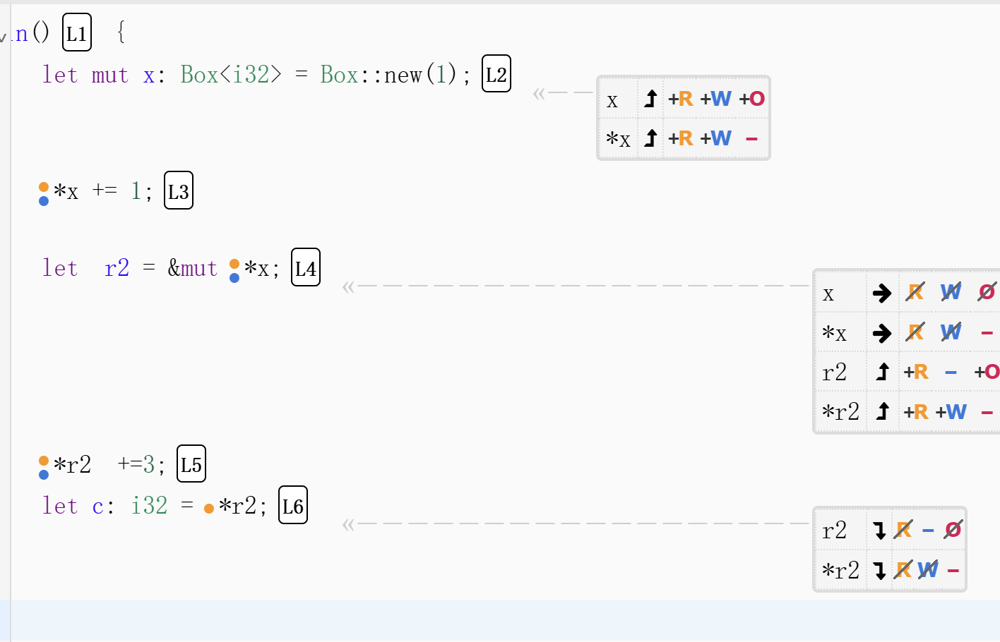

思考

事实上 我还是能够构建出 导致两个变量同时拥有一个地址所有权 ，但是这里在释放资源时

为什么没有多次释放资源的 undefine reference 
```rust
fn main() {
        let mut x: Box<i32> = Box::new(1); 
        *x += 1;               
                                
        let  r2 = &mut *x; 
        *r2  +=3;   
        let c: i32 = *r2;  
        println!{"{x}"};
        println!("{c}");
        println!{"{x}"};
        println!("{c}");
}

//out   
//    Compiling a v0.1.0 (/root/rust/a)
//     Finished `dev` profile [unoptimized + debuginfo] target(s) in 0.22s
//      Running `target/debug/a`
// 5
// 5
// 5
// 5

```
answer maybe: 事实上，r2 拿到了ownership后，在生命周期结束后 还是要把o权限还给x 

